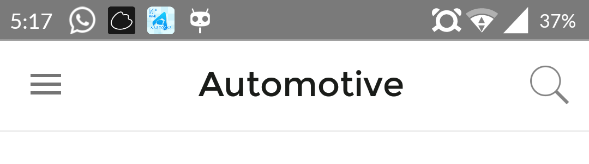
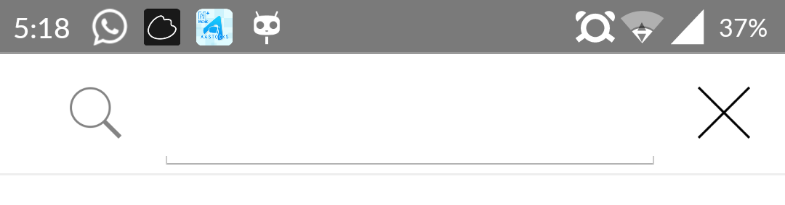

# Advanced Toolbar support library

[][4]
[ ][5]


```gradle

dependencies {
    compile 'com.hkm.advancedtoolbar:advancedtoolbar:0.6.2'
}

```


##setup this gradle only stores at 
```gradle
repositories {
    maven {  url "http://dl.bintray.com/jjhesk/maven"  }
}
```
Android ActionBar Advanced Support Library for API v23, v22, v21, v19. This library gives a better hand to handle all sorts of interactions on the toolbar. There are various built-in API and methods to speed up the development and design requirements and implemenations. There are fundamental design patterns are ready to be explored. The features listed as below:

- automatic show and hide softkeyboard
- social bar for sharing content implementation
- animation of the search bar and search view design for custom layouts
- custom textview and design
- dynamic custom icon and textview on top of Thanks to [mikepenz][1]
- interchangable between logos and the backgrounds
- title history support
- title shown as single line or more than single line
- Custom call back `onButtonPressListener`

Project Website: [TOOLBARLIB][2]

##Quick review

- [x] Custom Textview
- [x] Center Textview alignment


- [x] Search pattern redesigned


- [x] CandyBar implementation


##implementation
You can call by simple direct API from the code and it will do the magic for you.
The new implementation - [the easiest][3]
Simple way to start your module
```java
TopBarManager actionToolBar =      
    TopBarManager.ManagerBulider.with(this)
    ...
        .companyLogo(R.drawable.actionbar_bg_pb_logo)
        .background(R.drawable.actionbar_bg_white_greyline)
        .burgerIcon(R.mipmap.ic_action_menu)
        .searchView(SearchCustom.LAYOUT.classic_3)
    ...
        .build(tb);
```
Implementation of the search view:
```java

...
    .searchBarEvents(new TopBarManager.searchBarListener() {
                @Override
                public void onKeySearchStartConfirm(String s) {
                    if (currentFragmentNow instanceof listTemplate) {
                        listTemplate k = (listTemplate) currentFragmentNow;
                        k.triggerSearch(s);
                    } else {
                        setinternalChangeNoToggle(listTemplate.B(listTemplate.conSearch(s)), "search");
                    }
                }

                @Override
                public void onKeySearchLetter(String s) {

                }

                @Override
                public void onRestoreToNormal(ActionBar actionBar) {
                    actionToolBar.showBack();
                }
    })

...
```
# Methods table for custom toolbar introduction

There are several attributes you can set:

| methods | func |
|:---|:---|
| searchView | there are 4 options. The available options are ```classic_3```, ```classic_2```, ```classic_1```  |
| companyLogo | The drawable Id for the company logo |
| background | The navigation bar background drawable Id |
| burgerIcon | customize the top left corner icon with the resource Id |
| searchBarEvents | the implementation of the listener event for the plugins |
| setLiveIcon | there are two overriding: 1) is the actual LiveIcon object . 2) two configurations for the layout xml resource id and the image resource id|

# Implementation for dynamic icon for on the action tool bar
###setup 1: prepare the custom layout for the dynamic icon and here is the sample
```xml
<?xml version="1.0" encoding="utf-8"?>
<FrameLayout xmlns:android="http://schemas.android.com/apk/res/android"
    android:id="@id/liveicon_counterpanel"
    style="?android:attr/actionButtonStyle"
    android:layout_width="48dp"
    android:layout_height="48dp"
    android:clickable="true"
    android:focusable="true"
    android:gravity="center">


    <ImageView
        android:id="@id/liveiconloc"
        android:layout_width="match_parent"
        android:layout_height="match_parent"
        android:scaleType="centerInside" />

    <RelativeLayout
        android:id="@id/liveicon_position"
        android:layout_width="match_parent"
        android:layout_height="wrap_content"
        android:layout_marginTop="11dp">

        <TextView
            android:id="@id/liveicon_text"
            android:layout_width="match_parent"
            android:layout_height="match_parent"
            android:layout_centerInParent="true"
            android:gravity="center"
            android:text="88+"
            android:textColor="#FFFFFF"
            android:textSize="15dp" />
    </RelativeLayout>
</FrameLayout>
```
###setup 2: setup on configurations
```java
   worker = TopBarManager.ManagerBulider.with(this)
   ...
   .setLiveIcon(layout_id , drawable_id)
   ...
   .build(toolbar);
```
###setup 3: retrieve the object ```LiveIcon```
```java
   dynamic_icon = worker.getDynamicIcon();
```
###setup 4: inject object into these overrides
```java
   @Override
    public boolean onCreateOptionsMenu(Menu menu) {
        getMenuInflater().inflate(R.menu.main, menu);
        ...
        // the id of the menu item
        dynamic_icon.onOptionItemInit(menu, R.id.dynamic);
        ...
        return true;
    }
    
       @Override
    public boolean onOptionsItemSelected(MenuItem item) {
        if (item.getItemId() == R.id.dynamic) {
            dynamic_icon.update(item, [the new number] );
        }
        return super.onOptionsItemSelected(item);
    }
```
# Implementation for the Candy Bar
```java
   worker = CandyBar
            .Builder.with(this)
            .companyLogo(R.drawable.starz_logo)
            .searchView(LayoutAsset.classic_3)
            .searchBarEvents(new TopBarManager.searchBarListener() {
                        @Override
                        public void onKeySearchStartConfirm(String text) {
                            Log.d("start", text);
                        }

                        @Override
                        public void onKeySearchLetter(String text) {
                            Log.d("start", text);
                        }

                        @Override
                        public void onRestoreToNormal(ActionBar toolbar) {
                            worker.showBack();
                        }
                    })
            .setNotificationOffset(15)
            .setNotificationDrawableId(R.drawable.notg)
            .overrideIcons(R.mipmap.cross_grey, R.mipmap.ic_action_close, R.mipmap.crossmp)
            .background(R.drawable.bottom_line)
            .presetCountNotification(u)
            .build(toolbar);

```
Other manipulations
```java
       //demo to show the title only
              worker.showTitle("fill this up now");

       //demo to show the title only
              worker.showLogo();

       //demo to show the title only
              worker.triggerfromSearchIcon();

       //demo to show the title only
              worker.updateCount(u++);

       //demo to show the title only
              worker.updateCount(0);

       //demo to show the previous layout
              worker.showBack();

```


# Beast Bar

Put the following code into the onCreate section


```java


   Toolbar temp = (Toolbar) findViewById(R.id.toolbar);


  BeastBar.Builder bb = new BeastBar.Builder();
  //enter your back icon
        bb.back(R.drawable.ic_m_back);
  //enter your company icon
        bb.companyIcon(R.drawable.starz_logo);
  //enter your background drawable
        bb.background(R.drawable.actionbar_bg_dark_black);
   //enter your search icon
        bb.search(R.drawable.ic_find_mg);

  final BeastBar toolbar = BeastBar.withToolbar(this, temp, bb);

```


# Implementation for the social tool bar

Add this component into your xml layout in anywhere
```xml
      <com.hkm.advancedtoolbar.socialbar.combar
                    android:id="@+id/social_bar_combar"
                    android:layout_width="match_parent"
                    android:layout_height="wrap_content"
                    android:layout_marginLeft="10dp"
                    android:layout_marginTop="10dp" />

```
retrieve the component ```combar``` and use the method ```setShareContent``` to inject the information needed for the sharing intents. Please also refer to the table.
```java
      public void setShareContentBar(String title, String except, String link) {
            combar mCombo = (combar) content_view.findViewById(R.id.social_bar_combar);
            mCombo
            .connectAlert(getFragmentManager())
            .setShareContent(title, except, link);
        }
```

Social Bar method table for ```combar```:

| methods | func |
|:---|:---|
| searchView | there are 4 options. The available options are ```classic_3```, ```classic_2```, ```classic_1```  |
| setShareContent | inject information into the sharing intents |


[1]: https://github.com/mikepenz/Android-ActionItemBadge
[2]: https://github.com/jjhesk/ToolBarLib
[3]: https://github.com/jjhesk/ToolBarLib/wiki/The-Easy-Way
[4]: http://android-arsenal.com/details/1/2158
[5]: https://bintray.com/jjhesk/maven/advancedtoolbar/_latestVersion
